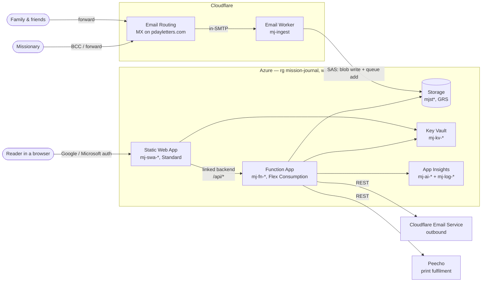
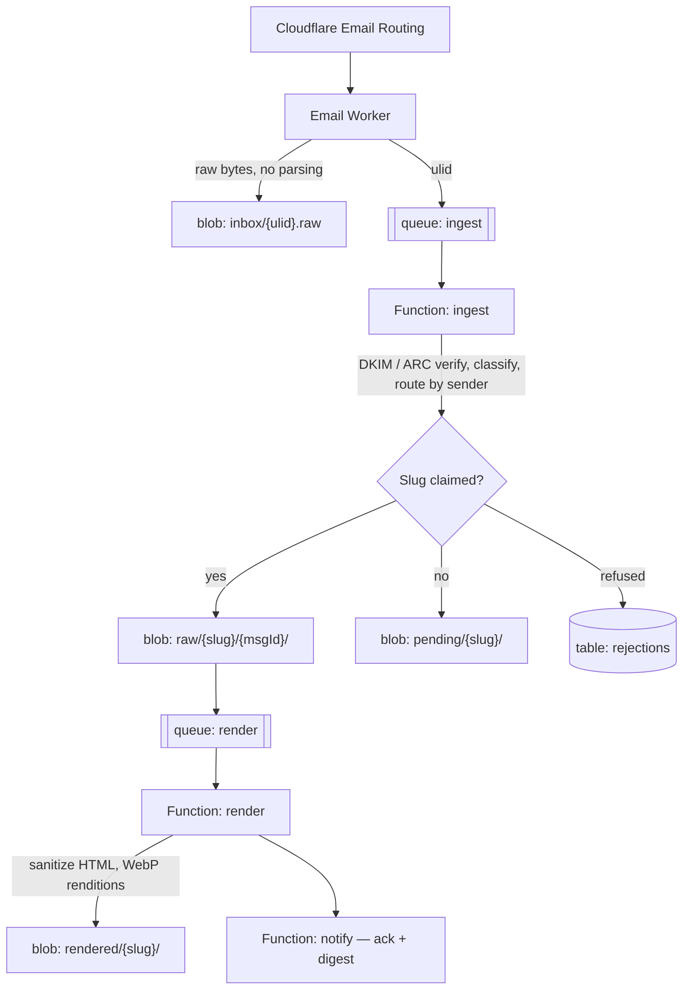
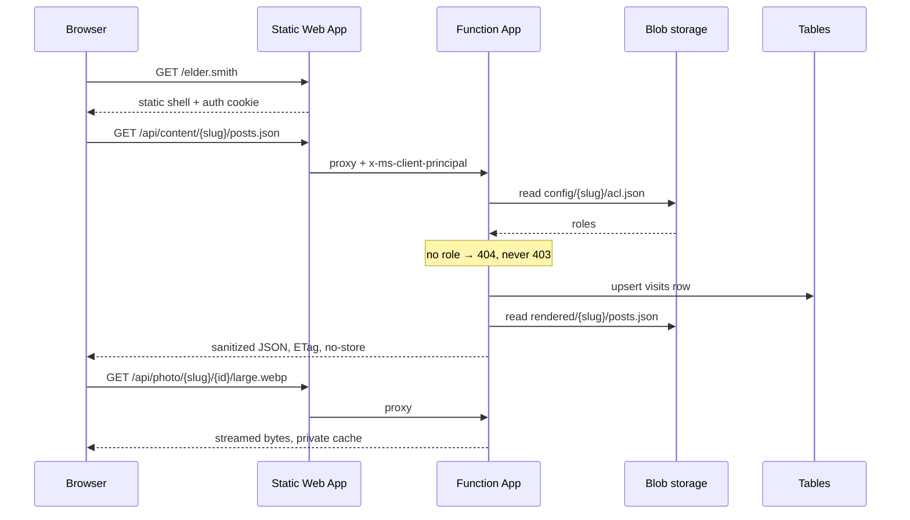
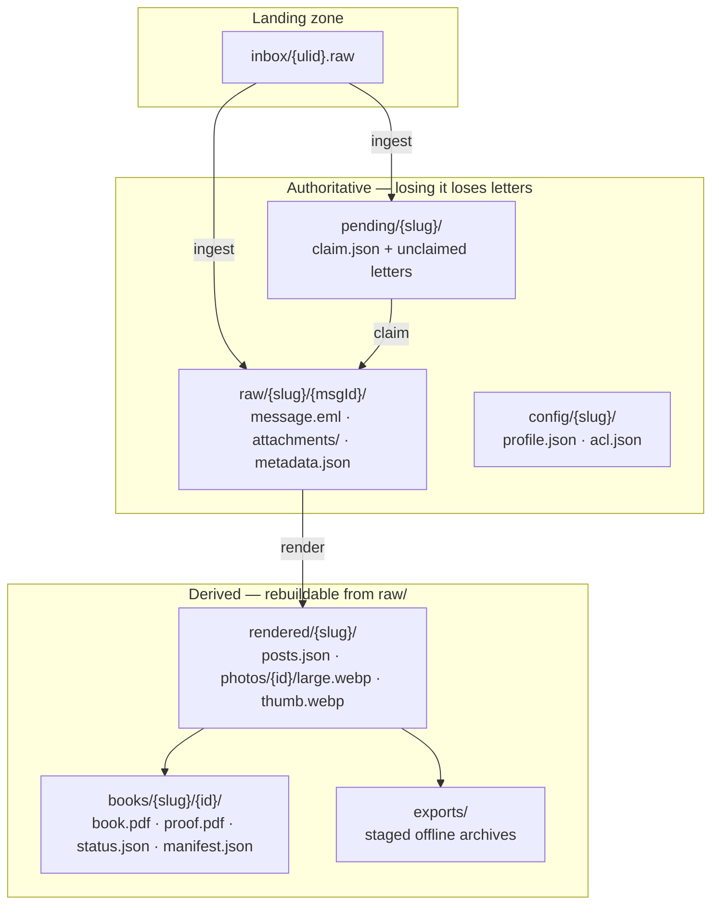
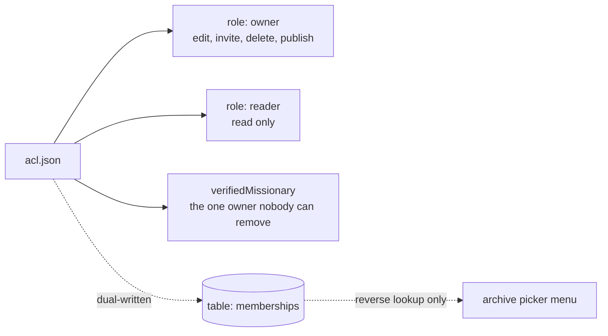
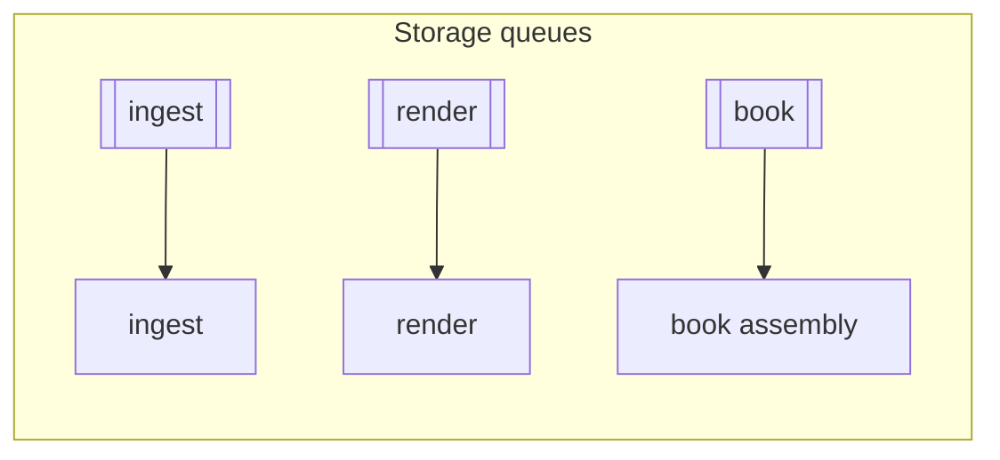
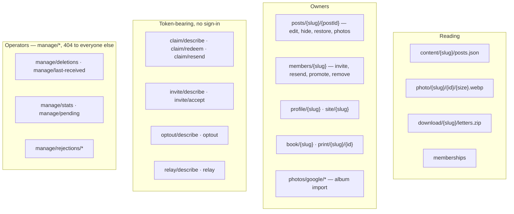
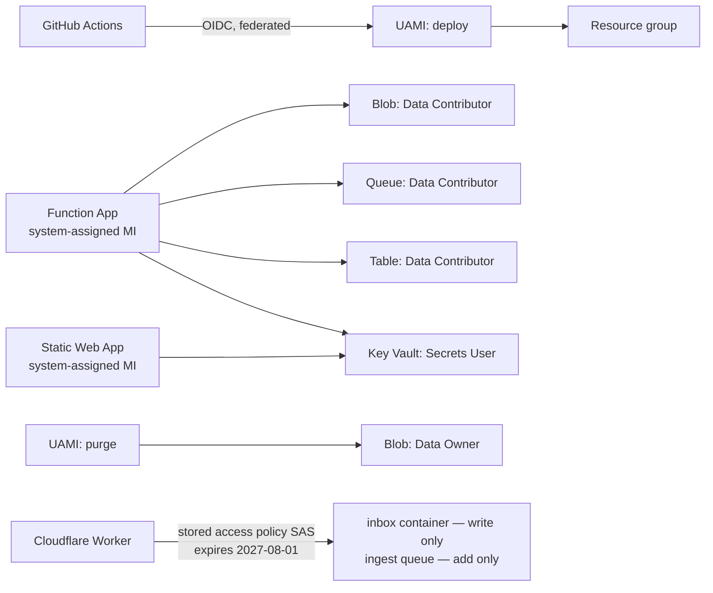

# Architecture

What exists in Azure and Cloudflare, and how the pieces connect. Every "why" lives in [plan.md](plan.md) — this file is the map, not the reasoning.

---

## System overview

Details: [High-level architecture](plan.md#high-level-architecture) · [Azure resource plan](plan.md#azure-resource-plan) · [External constraints](plan.md#external-constraints)

---

## Ingest pipeline

Details: [Email ingestion](plan.md#email-ingestion) · [Cloudflare Email Routing](plan.md#email-ingestion--cloudflare-email-routing) · [Missionary routing](plan.md#missionary-routing) · [Content sanitization](plan.md#content-sanitization) · [Photo handling](plan.md#photo-handling)

---

## Read path

Nothing in storage is public. Every byte a browser sees passes an ACL check first.

Details: [Private content delivery](plan.md#private-content-delivery) · [Access control](plan.md#access-control) · [Signing in and getting around](plan.md#signing-in-and-getting-around) · [Service operators](plan.md#service-operators)

---

## Blob containers

All private, no public access. One GRS account holds everything durable.

| Container | Lifecycle |
|---|---|
| `inbox` | deleted after 30 days, versions and snapshots too |
| `exports` | deleted after 7 days |
| `raw` | moved to Cool after 30 days |
| all | superseded blob versions expire after 30 days |

`raw/` is never served to anyone and is not in the offline export — it exists for reprocessing and for authorship evidence.

Details: [Storage layout](plan.md#storage-layout) · [Data model](plan.md#data-model-postsjson-entry) · [Journal Publish](plan.md#journal-publish) · [Post-mission archive](plan.md#post-mission-archive)

---

## `config/{slug}/acl.json`

The source of truth for who may read a site. Checked on **every** content request; no table may override it.

Details: [Access control](plan.md#access-control) · [Ownership and the 60-day window](plan.md#ownership-and-the-60-day-window)

---

## Tables

Same storage account. Keys as written; every one is a point read or a single-partition query except where noted.

```mermaid
erDiagram
    users {
        string PartitionKey "lowercased email"
        string RowKey "profile"
        string columns "auth provider, digest prefs, claim schedule"
    }
    memberships {
        string PartitionKey "lowercased email"
        string RowKey "slug"
        string note "DERIVED from acl.json - never grants access"
    }
    sites {
        string PartitionKey "slug"
        string RowKey "activity"
        string columns "display name, mission dates, lastPostAt, lastReceivedAt"
    }
    invites {
        string PartitionKey "slug"
        string RowKey "hash of the invitation token"
        string note "the hash revokes; it does not accept"
    }
    arrivals {
        string PartitionKey "slug:YYYY-MM-DD"
        string RowKey "message ULID"
        string note "daily cap guard - swept after 30 days"
    }
    visits {
        string PartitionKey "YYYY-MM-DD"
        string RowKey "slug + bar + sha256 of the address"
        string note "one row per person per archive per day - swept after 40"
    }
    deletions {
        string PartitionKey "slug"
        string RowKey "record"
        string note "AUTHORITATIVE - the 30-day promise lives here"
    }
    optouts {
        string PartitionKey "optout"
        string RowKey "sha256 of email"
        string note "AUTHORITATIVE - nothing else records a refusal"
    }
    deliveries {
        string PartitionKey "delivery"
        string RowKey "sha256 of email"
        string note "DERIVED from Cloudflare suppression"
    }
    rejections {
        string PartitionKey "slug"
        string RowKey "message ULID"
        string note "AUTHORITATIVE - the only trace of a refused first letter"
    }
    identities {
        string PartitionKey "identity"
        string RowKey "sha256 of provider and userId"
        string note "DERIVED - repaired by signing in again"
    }
    nudges {
        string PartitionKey "lowercased email"
        string RowKey "slug:kind"
        string note "send-once guard for reminder mail"
    }
```

Details: [Storage layout](plan.md#storage-layout) · [Notification preferences](plan.md#notification-preferences) · [New-letter notifications](plan.md#new-letter-notifications) · [Onboarding and auto-provisioning](plan.md#onboarding-and-auto-provisioning)

---

## Queues and scheduled work

| Timer | UTC | What it does |
|---|---|---|
| `purge` | 03:15 | erase expired `pending/` sites |
| `remind` | 03:45 | tapering claim re-invitations |
| `sweep` | 03:45 | drop finished `arrivals` and `visits` rows |
| `erase` | 04:15 | erase archives past the 30-day deletion window |
| `digest` | 13:15 | new-letter digests |

Book assembly is its own queue: a render is one letter and takes a second, a book is a whole archive and takes minutes.

Details: [New-letter notifications](plan.md#new-letter-notifications) · [Journal Publish](plan.md#journal-publish) · [Onboarding and auto-provisioning](plan.md#onboarding-and-auto-provisioning)

---

## HTTP API

All routes are behind the Static Web App at `/api/*` and authorize inside the handler.

`admin/` is reserved by the Functions host, which is why operator routes are `manage/`.

Details: [Service operators](plan.md#service-operators) · [Editing and hiding posts](plan.md#editing-and-hiding-posts) · [Moderation / quarantine](plan.md#moderation--quarantine) · [The photo album](plan.md#the-photo-album) · [Adding pictures from Google Photos](plan.md#adding-pictures-from-google-photos)

---

## Identity and secrets

No storage connection string and no Azure credential is stored in this repository.

Key Vault holds the auth client secrets, the claim-token signing key, the Cloudflare API token, and the Peecho keys. A second storage account (`mjdep*`, LRS, Hot) holds only the deployment package — separated so versioning and GRS apply to letters and not to a zip republished daily.

Details: [Azure resource plan](plan.md#azure-resource-plan) · [External constraints](plan.md#external-constraints)

---

## Observability

App Insights is workspace-based on `mj-log-*` with a **1 GB/day ingest cap** and a scheduled-query alert on approach. Key Vault secret expiry raises Event Grid events to an action group. The Cloudflare Worker is the one component whose telemetry does not reach App Insights — Workers Logs is its only record.
